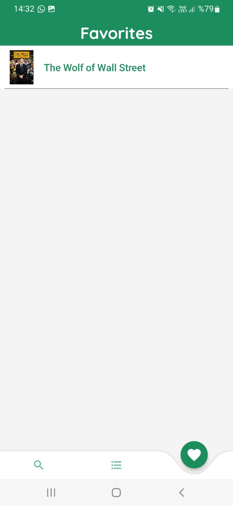

# TheMovieManager

### Project Information

- You can login with your email and password.

- By searching on the search page, you can see the movie photo, movie name and movie date, and click on the one you want to go to the detail page.

- On the detail page, you can add the movie to favorites or watchlist. Then you can see the movie's name and photo in the watch list or favorites.

------------
#### Screenshots
  
<table>
  <tr>
    <td></td>
    <td></td>
    <td></td>
      <td></td>
  </tr>
 </table>
 
  

<table>
  <tr>
  <td></td>
    <td></td>
    <td></td>
    <td></td>
  </tr>
 </table>
 
  

<table>
 
  <tr>
    <td></td>
    <td></td>
    <td></td>
    <td></td>
  </tr>
 </table>
 
  

<table>
 
  <tr>
    <td></td>
    <td></td>
  </tr>
 </table>

------------

